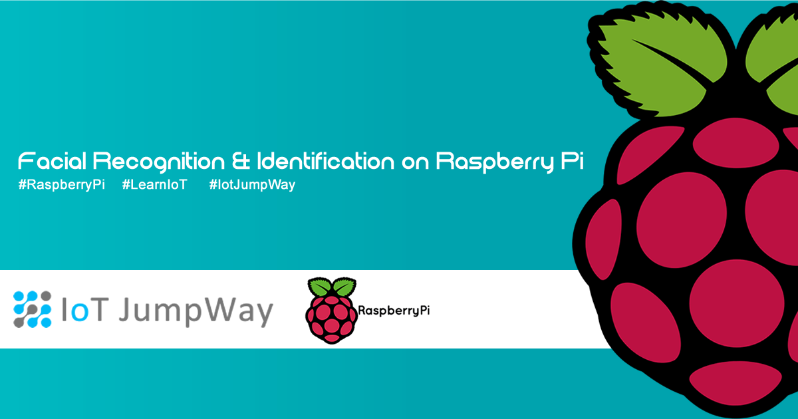
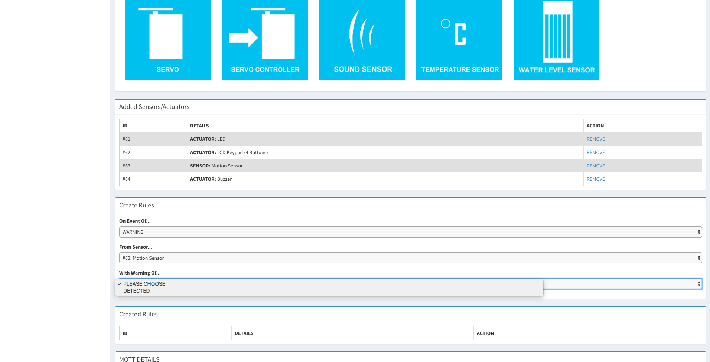

# Facial Recognition & Identification on Raspberry Pi



## Introduction
Facial recognition and identification will soon be playing a major role in our every day lives. The technology opens up a whole new world of possibilities, and applies to almost every aspect of our lives. Use cases of facial recognition/identification include security systems, authentication systems, personalised smart homes, and home care assistants.

## What Will We Build?
This tutorial will help you to build a Raspberry Pi that allows you to train a Haarcascades model, detect recognised/unknown people, optionally monitor the camera in near realtime via a stream, and communicate with the IoT JumpWay sending sensor and warning messages that will allow your device to autonomously communicate with other IoT devices on your IoT JumpWay network.

This tutorial will use IoT JumpWay Python MQTT Library for communication, OpenCV for computer vision, Motion to stream the webcame on a local port and a secure Nginx server so that the stream can be accessed safely from the outside world.

This example was our original version of TASS, since our move forward with more advanced computer vision libraries and frameworks, we decided to open up the source code.

## Python Versions

- 2.7
- 3.4 or above

## Software Requirements

- [IoT JumpWay Python MQTT Client](https://github.com/iotJumpway/JumpWayMQTT "IoT JumpWay Python MQTT Client")

## Hardware requirements


1. Raspberry Pi.
2. Linux Compatible Webcam

## Before You Begin

There are a few tutorials that you should follow before beginning, especially if it is the first time you have followed any of our Raspberry Pi tutorials or if it is the first time you have used the IoT JumpWay Developer Program.

- [IoT JumpWay Developer Program Docs (5-10 minute read/setup)](https://github.com/iotJumpway/IoT-JumpWay-Docs/ "IoT JumpWay Developer Program Docs (5-10 minute read/setup)")

- [Preparing Your Raspberry Pi](https://github.com/iotJumpway/IoT-JumpWay-RPI-Examples/blob/master/_DOCS/1-Raspberry-Pi-Prep.md "Preparing Your Raspberry Pi")

- [Setup Domain Name & SSL For Your Raspberry Pi](https://github.com/iotJumpway/IoT-JumpWay-RPI-Examples/blob/master/_DOCS/3-Raspberry-Pi-Domain-And-SSL.md "Setup Domain Name & SSL For Your Raspberry Pi")

- [Installing OpenCV On Your Raspberry Pi](https://github.com/iotJumpway/IoT-JumpWay-RPI-Examples/blob/master/_DOCS/2-Installing-OpenCV.md "Installing OpenCV On Your Raspberry Pi")

- [Installing Linux Motion On Your Raspberry Pi](https://github.com/iotJumpway/IoT-JumpWay-RPI-Examples/blob/master/_DOCS/5-Installing-Motion.md "Installing Linux Motion On Your Raspberry Pi")

- [Installing Secure Nginx Server For Linux Motion On Raspberry Pi](https://github.com/iotJumpway/IoT-JumpWay-RPI-Examples/blob/master/_DOCS/6-Secure-Nginx-Server-For-Motion.md "Installing Secure Nginx Server For Linux Motion On Raspberry Pi")

- [Securing Your Raspberry Pi With IPTables](https://github.com/iotJumpway/IoT-JumpWay-RPI-Examples/blob/master/_DOCS/4-Securing-Your-Raspberry-Pi-With-IPTables.md "Securing Your Raspberry Pi With IPTables")

## Cloning The Repo

You will need to clone the IoT JumpWay Raspberry Pi Examples repository to a location on your Raspberry Pi. Navigate to the directory you would like to download it to and issue the following commands, easiest is to download it to your home directory.

    $ git clone https://github.com/iotJumpway/IoT-JumpWay-RPI-Examples.git

## Install Requirements

Next you will need to navigate to the Computer-Vision directory and install the requirements

    $ cd IoT-JumpWay-RPI-Examples/Computer-Vision/Python
    $ pip install --upgrade pip
    $ pip install -r requirements.txt

## Installing Open CV

OpenCv needs to be installed, follow the [Installing OpenCV On Your Raspberry Pi](https://github.com/iotJumpway/IoT-JumpWay-RPI-Examples/blob/master/_DOCS/2-Installing-OpenCV.md "Installing OpenCV On Your Raspberry Pi") tutorial to accomplish this, this is the computer vision library we will be using.

## Installing Linux Motion

We will use Linux Motion to stream a live feed to a local port on the Raspberry Pi which OpenCv will connect to and read in the frames from the stream. To get Linux Motion set up, follow the [Installing Linux Motion On Your Raspberry Pi](https://github.com/iotJumpway/IoT-JumpWay-RPI-Examples/blob/master/_DOCS/5-Installing-Motion.md "Installing Linux Motion On Your Raspberry Pi") tutorial.

There are some modifications to make here, in section 9 of the Motion tutorial, it tells you how to modify the directory where the media is saved, for this tutorial you should change that settings to:

	/home/YOURUSERNAME/IoT-JumpWay-RPI-Examples/Computer-Vision/Python/media

Don't forget to check out section 10 with regards to turning off the saving of images to save diskspace.

## Setup Domain Name & SSL For Your Raspberry Pi

We like to make sure that we try to provide tutorials that will help people learn to create secure projects. For the video stream to work securely, you will need to set up a domain name that is pointed to your Raspberry Pi, you will also need to set up an SSL certificate to ensure that the server used for streaming the video is secure. The [Setup Domain Name & SSL For Your Raspberry Pi](https://github.com/iotJumpway/IoT-JumpWay-RPI-Examples/blob/master/_DOCS/3-Raspberry-Pi-Domain-And-SSL.md "Setup Domain Name & SSL For Your Raspberry Pi") tutorial explains how to do this, if in doubt ask your registrar or host to assist you. If you cloned this repository to your home directory, the paths that you need to use for your CSR and key generation in the following tutorial are:

```
/etc/nginx/key.key
```

and

```
/etc/nginx/csr.csr
```

Once you have received your signed crt.crt and ca.crt file from certificate authority, you need to upload them to:

```
/etc/nginx/ca.crt
```

and

```
/etc/nginx/crt.crt
```

## Installing A Secure Nginx Server For Linux Motion

We will use Nginx as our server solution and set it up in a way that it has a Grade A+ SSL rating on Qualys SSL Labs SSL Report. To do this we have provided a guide in the [Installing Secure Nginx Server For Linux Motion On Raspberry Pi](https://github.com/iotJumpway/IoT-JumpWay-RPI-Examples/blob/master/_DOCS/6-Secure-Nginx-Server-For-Motion.md "Installing Secure Nginx Server For Linux Motion On Raspberry Pi"), follow this tutorial to set up your server. You will need of completed the [Installing Linux Motion On Your Raspberry Pi](https://github.com/iotJumpway/IoT-JumpWay-RPI-Examples/blob/master/_DOCS/5-Installing-Motion.md "Installing Linux Motion On Your Raspberry Pi") and [Setup Domain Name & SSL For Your Raspberry Pi](https://github.com/iotJumpway/IoT-JumpWay-RPI-Examples/blob/master/_DOCS/3-Raspberry-Pi-Domain-And-SSL.md "Setup Domain Name & SSL For Your Raspberry Pi") tutorials before starting this step.

## Securing Your Raspberry Pi With IPTables

The next security step you should take is setting up IPTables, the following tutorial will show you how:

[Securing Your Raspberry Pi With IPTables](https://github.com/iotJumpway/IoT-JumpWay-RPI-Examples/blob/master/_DOCS/4-Securing-Your-Raspberry-Pi-With-IPTables.md "Securing Your Raspberry Pi With IPTables")

## Video Stream

Once you have followed the above steps, if they are not already running you need to do the following in this order:

1. Start Linux Motion:

```
$ sudo service motion start
```

OR:

```
$ sudo /etc/init.d/motion start
```

2. Start Nginx:

```
$ sudo service nginx start
```

OR:

```
$ sudo /etc/init.d/nginx start
```

IMPORTANT: This way of streaming is a new feature and we are still ironing out some kinks, if you would like to have OpenCV access the webcam directly and not have Motion/Nginx streaming, uncomment line 43 in TASS.py and comment out lines 44 and 45.

## Connection Credentials & Sensor Settings

The next steps will be to setup your device instance in the IoT JumpWay Developer Console.

- Follow the [IoT JumpWay Location Device Doc](https://github.com/iotJumpway/IoT-JumpWay-Docs/blob/master/4-Location-Devices.md "IoT JumpWay Location Device Doc") to set up your device. You will need to set up a device that has a CCTV Camera added via the Sensors/Actuators section.


- Retrieve your connection credentials and update the **required/config.json** file with your new connection credentials and camera ID setting (You will need to go into the device page after creating it to get your correct camera ID).

```
"IoTJumpWay": {
	"Location": 0,
	"Zone": 0,
	"Device": 0,
	"DeviceName" : "",
	"App": 0,
	"AppName": ""
}
```

```
"StreamSettings":{
	"streamIP":"",
	"streamPort":1234
}
```

```
"IoTJumpWayMQTT": {
	"MQTTUsername": "",
	"MQTTPassword": "",
	"AppMQTTUsername": "",
	"AppMQTTPassword": ""
}
```

## Training Your Data

Now that the basics are set up, it is time to train your model with your own photos. When you download this repo, there will already be a trained model and processed images in the processed folder, but this model will not recognise you. You should make a good selection of photos of yourself in different positions and lighting. The more photos you train your model on, the more accurate it will be, if your device is not identifying you you simply need to train it with more images of yourself.

You can add as many images as you like (Dependant on the space available on your RPI 3), for as many people as you like. To add training data navigate to the training folder and create a directory, the directory should be a number, and not a number that is already in the processed folder.

Once you have built up your folder of images, head over to TASS.py and change line 34 (self.train = 0) to self.train = 1 and the start the program. The program will loop through your images and if it detects a face it will recreate an image in the format required for the model, save it to a matching folder in the processed directory, and delete the original image to save space. If it does not detect a face it will simply delete the original image as it is useless for the facial recognition.

Once the processing stage has finished, your new model will automatically start training, once training is finished, it will automatically run the main facial recognition program. Put your face in front of your connected webcam and watch the output of the program as it tries to identify who you are.

NOTE: Remove the README file from  the processing directory.

## Executing The Program

```
$ sudo python/python3 TASS.py
```

## Autonomous IoT Communication

Each time your device detects a person, the device will send sensor data to the  [IoT JumpWay](https://iot.techbubbletechnologies.com/ "IoT JumpWay") and warning alerts will be sent when the motion sensor picks up an intruder. You can use sensor values and warning messages to trigger autonomous communication with other devices you have connected to your IoT JumpWay Location Space.

On the device edit page, scroll down to the "Create Rules" section under the "Actuators / Sensors". Here you can use the dropdown menu to create rules that allow your device to email you or to autonomously communicate with other devices on its network in the event of status updates, sensor data and warnings.



## Viewing Your Data

You will be able to access the data in the [IoT JumpWay Developers Area](https://iot.techbubbletechnologies.com/developers/dashboard/ "IoT JumpWay Developers Area"). Once you have logged into the Developers Area, visit the [IoT JumpWay Location Devices Page](https://iot.techbubbletechnologies.com/developers/location-devices "Location Devices page"), find your device and then visit the "Sensor/Actuator Data" page and the "Commands Data" page to view the data sent from your device.


## Bugs/Issues

Please feel free to create issues for bugs and general issues you come across whilst using the IoT JumpWay Raspberry Pi Examples. You may also use the issues area to ask for general help whilst using the IoT JumpWay Raspberry Pi Examples in your IoT projects.

## Contributors

[](https://github.com/AdamMiltonBarker)


