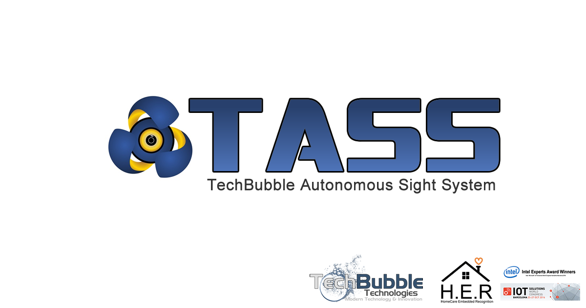

# IoT JumpWay Raspberry Pi Computer Vision Example (TASS)

 

## Introduction

Here you will find sample device scripts for connecting a Raspberry Pi 3 to the TechBubble Technologies IoT JumpWay using the Python MQTT Library for communication and OpenCV for computer vision. The codes allow you to set up a basic device that allows you to train a Haarcascades model, detect recognised / unknown people, optionally monitor the camera in near realtime via a stream, and communicate with the IoT JumpWay sending sensor and warning messages. Once you understand how it works you are free to add as many actuators and sensors to your device and modify your code accordingly.

This example was our original version of TASS, since our move forward with more advanced computer vision libraries and frameworks, we decided to open up the source code.

## Python Versions

- 2.7
- 3.4 or above

## Hardware requirements

  

1. Raspberry Pi.
2. Linux Compatible Webcam

## Software requirements

1. TechBubbleIoTJumpWayMQTT  
2. JSon
3. Flask
4. Flask-Basicauth

## Before You Begin

If this is the first time you have used the TechBubble IoT JumpWay in your IoT projects, you will require a developer account and some basics to be set up before you can start creating your IoT devices. Visit the following link and check out the guides that take you through registration and setting up your Location Space, Zones, Devices and Applications.

[TechBubble Technologies IoT JumpWay Developer Program (BETA) Docs](https://github.com/TechBubbleTechnologies/IoT-JumpWay-Docs/ "TechBubble Technologies IoT JumpWay Developer Program (BETA) Docs")

## Preparing Your Raspberry Pi 3

Take some time to ensure your Raspberry Pi firmware and packages are up to date, and that your device is secure by following the guide below.

[Raspberry Pi 3 Preparation Doc](https://github.com/TechBubbleTechnologies/IoT-JumpWay-RPI-Examples/blob/master/_DOCS/1-Raspberry-Pi-Prep.md "Raspberry Pi 3 Preparation Doc")

## Cloning The Repo

You will need to clone this repository to a location on your Raspberry Pi 3. Navigate to the directory you would like to download it to and issue the following commands.

    $ git clone https://github.com/TechBubbleTechnologies/IoT-JumpWay-RPI-Examples.git

## Installing Open CV

You will need to install OpenCV for this example to work, please follow the document below to install OpenCV on your Raspberry Pi 3.

[Raspberry Pi 3 OpenCV Installation Doc](https://github.com/TechBubbleTechnologies/IoT-JumpWay-RPI-Examples/blob/master/_DOCS/2-Installing-OpenCV.md "Raspberry Pi 3 OpenCV Installation Doc")

## Install Requirements

Next you will need to navigate to the Computer-Vision directory and install the requirements

    $ cd IoT-JumpWay-RPI-Examples/Computer-Vision/Python
    $ pip install --upgrade pip
    $ pip install -r requirements.txt

## Video Stream

The video stream is off by default, to turn on the video stream update the AppServerSettings settings in config.json. The video stream requires SSL, follow the document below that explains how to set up your domain name and SSL to point to your Raspberry Pi 3. 

```
	"AppServerSettings":{
		"serverOn":1,
		"serverIP":"YOUR RPI 3 IP",
		"serverUser":"YOUR SERVER USERNAME",
		"serverPassword":"YOUR SERVER PASSWORD"
	}
```

TBC