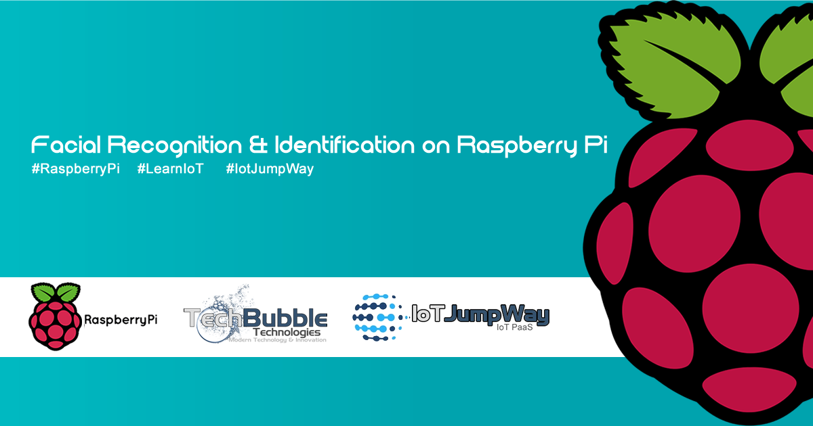

# Facial Recognition & Identification on Raspberry Pi

  

## Introduction
Facial recognition and identification will soon be playing a major role in our every day lives. The technology opens up a whole new world of possibilities, and applies to almost every aspect of our lives. Use cases of facial recognition/identification include security systems, authentication systems, personalised smart homes, and home care assistants.

## What Will We Build?
This tutorial will help you to build a Raspberry Pi that allows you to train a Haarcascades model, detect recognised/unknown people, optionally monitor the camera in near realtime via a stream, and communicate with the IoT JumpWay sending sensor and warning messages that will allow your device to autonomously communicate with other IoT devices on your IoT JumpWay network.

This tutorial will use TechBubble Technologies IoT JumpWay Python MQTT Library for communication and OpenCV for computer vision.

(Tutorial to be updated soon to include our new streaming method)

This example was our original version of TASS, since our move forward with more advanced computer vision libraries and frameworks, we decided to open up the source code.

## Python Versions

- 2.7
- 3.4 or above

## Software Requirements

1. Jessie
2. [TechBubble IoT JumpWay Python MQTT Client](https://github.com/TechBubbleTechnologies/IoT-JumpWay-Python-MQTT-Clients "TechBubble IoT JumpWay Python MQTT Client")  
3. Flask
5. Flask-Basicauth

## Hardware requirements

  

1. Raspberry Pi.
2. Linux Compatible Webcam

## Before You Begin

There are a few tutorials that you should follow before beginning, especially if it is the first time you have followed any of our Raspberry Pi tutorials or if it is the first time you have used the TechBubble IoT JumpWay Developer Program.

- [IoT JumpWay Developer Program Docs (5-10 minute read/setup)](https://github.com/TechBubbleTechnologies/IoT-JumpWay-Docs/ "IoT JumpWay Developer Program Docs (5-10 minute read/setup)")

- [Preparing Your Raspberry Pi](https://github.com/TechBubbleTechnologies/IoT-JumpWay-RPI-Examples/blob/master/_DOCS/1-Raspberry-Pi-Prep.md "Preparing Your Raspberry Pi")

- [Installing OpenCV On Your Raspberry Pi](https://github.com/TechBubbleTechnologies/IoT-JumpWay-RPI-Examples/blob/master/_DOCS/2-Installing-OpenCV.md "Installing OpenCV On Your Raspberry Pi")

- [Setup Domain Name & SSL For Your Raspberry Pi](https://github.com/TechBubbleTechnologies/IoT-JumpWay-RPI-Examples/blob/master/_DOCS/3-Raspberry-Pi-Domain-And-SSL.md "Setup Domain Name & SSL For Your Raspberry Pi")

- [Securing Your Raspberry Pi With IPTables](https://github.com/TechBubbleTechnologies/IoT-JumpWay-RPI-Examples/blob/master/_DOCS/4-Securing-Your-Raspberry-Pi-With-IPTables.md "Securing Your Raspberry Pi With IPTables")

## Cloning The Repo

You will need to clone the TechBubble IoT JumpWay Raspberry Pi Examples repository to a location on your Raspberry Pi. Navigate to the directory you would like to download it to and issue the following commands, easiest is to download it to your home directory.

    $ git clone https://github.com/TechBubbleTechnologies/IoT-JumpWay-RPI-Examples.git

## Install Requirements

Next you will need to navigate to the Computer-Vision directory and install the requirements

    $ cd IoT-JumpWay-RPI-Examples/Computer-Vision/Python
    $ pip install --upgrade pip
    $ pip install -r requirements.txt

## Installing Open CV

In addition OpenCv needs to be installed, follow the [Installing OpenCV On Your Raspberry Pi](https://github.com/TechBubbleTechnologies/IoT-JumpWay-RPI-Examples/blob/master/_DOCS/2-Installing-OpenCV.md "Installing OpenCV On Your Raspberry Pi") tutorial to accomplish this, this is the computer vision library we will be using.

## Connection Credentials & Sensor Settings

The next steps will be to setup your device instance in the IoT JumpWay Developer Console.

- Follow the [IoT JumpWay Location Device Doc](https://github.com/TechBubbleTechnologies/IoT-JumpWay-Docs/blob/master/4-Location-Devices.md "IoT JumpWay Location Device Doc") to set up your device. You will need to set up a device that has a CCTV Camera added via the Sensors/Actuators section.

  

- Retrieve your connection credentials and update the config.json file with your new connection credentials and camera ID setting (You will need to go into the device page after creating it to get your correct camera ID).

```
	"IoTJumpWaySettings": {
		"SystemLocation": 0,
		"SystemZone": 0,
		"SystemDeviceID": 0,
		"SystemDeviceName" : "Your Device Name",
		"SystemCameraID":0
	}
```

```
	"IoTJumpWayMQTTSettings": {
		"username": "Your MQTT Username",
		"password": "Your MQTT Password"
	}
```

## Video Stream

The video stream is off by default, to turn on the video stream update the AppServerSettings settings in config.json. The video stream requires SSL, follow the next step that explains how to set up your domain name and SSL to point to your Raspberry Pi. The server needs to run with Python 3, if not issues will occur when people connect.

```
	"AppServerSettings":{
		"serverOn":1,
		"serverIP":"YOUR RPI 3 IP",
		"serverUser":"YOUR SERVER USERNAME",
		"serverPassword":"YOUR SERVER PASSWORD"
	}
```

## Setup Domain Name & SSL For Your Raspberry Pi

For the video stream to work securely, you will need to set up a domain name that is pointed to your Raspberry Pi and you will also need to set up an SSL certificate to ensure that the server used for streaming the video is secure. The following document explains how to do this, if in doubt ask your registrar or host to assist you. If you cloned this repository to your home directory, the paths that you need to use for your CSR and key generation in the following tutorial are:

```
	~/IoT-JumpWay-RPI-Examples/Computer-Vision/Python/certs/key.key

```

and

```
	~/IoT-JumpWay-RPI-Examples/Computer-Vision/Python/certs/csr.csr 

```

Once you have received your signed .crt file from certificate authority, you need to upload it to:

```
	~/IoT-JumpWay-RPI-Examples/Computer-Vision/Python/certs/crt.csr 

```


## Securing Your Raspberry Pi With IPTables

The next security step you should take is setting up IPTables, the following tutorial will show you how:

[Securing Your Raspberry Pi With IPTables](https://github.com/TechBubbleTechnologies/IoT-JumpWay-RPI-Examples/blob/master/_DOCS/4-Securing-Your-Raspberry-Pi-With-IPTables.md "Securing Your Raspberry Pi With IPTables")

## Training Your Data

Now that the basics are set up, it is time to train your model with your own photos. When you download this repo, there will already be a trained model and processed images in the processed folder, but this model will not recognise you. You should make a good selection of photos of yourself in different positions and lighting. The more photos you train your model on, the more accurate it will be, if your device is not identifying you you simply need to train it with more images of yourself. 

You can add as many images as you like (Dependant on the space available on your RPI 3), for as many people as you like. To add training data navigate to the training folder and create a directory, the directory should be a number, and not a number that is already in the processed folder. 

Once you have built up your folder of images, head over to TASS.py and change line 34 (self.train = 0) to self.train = 1 and the start the program. The program will loop through your images and if it detects a face it will recreate an image in the format required for the model, save it to a matching folder in the processed directory, and delete the original image to save space. If it does not detect a face it will simply delete the original image as it is useless for the facial recognition. 

Once the processing stage has finished, your new model will automatically start training, once training is finished, it will automatically run the main facial recognition program. Put your face in front of your connected webcam and watch the output of the program as it tries to identify who you are. 

## Executing The Program

    $ sudo python/python3 TASS.py 

## Viewing Your Data  

Each time your device detects a person or an intruder, it will send data to the [TechBubble IoT JumpWay](https://iot.techbubbletechnologies.com/ "TechBubble IoT JumpWay"). You will be able to access the data in the [TechBubble IoT JumpWay Developers Area](https://iot.techbubbletechnologies.com/developers/dashboard/ "TechBubble IoT JumpWay Developers Area"). Once you have logged into the Developers Area, visit the [TechBubble IoT JumpWay Location Devices Page](https://iot.techbubbletechnologies.com/developers/location-devices "Location Devices page"), find your device and then visit the Sensor/Actuator page and the Warnings page to view the data sent from your device.


## Autonomous Device Communication

COMING SOON

## IoT JumpWay Raspberry Pi Computer Vision Example Bugs/Issues

Please feel free to create issues for bugs and general issues you come accross whilst using the IoT JumpWay Raspberry Pi Computer Vision Example. You may also use the issues area to ask for general help whilst using the IoT JumpWay Raspberry Pi Computer Vision Example in your IoT projects.

## IoT JumpWay Raspberry Pi Examples Contributors

  

- [Adam Milton-Barker, TechBubble Technologies Founder](https://github.com/AdamMiltonBarker "Adam Milton-Barker, TechBubble Technologies Founder")

- [Andrej Petelin, TechBubble Technologies Dev](https://github.com/AndrejPetelin "Andrej Petelin, TechBubble Technologies Dev")


