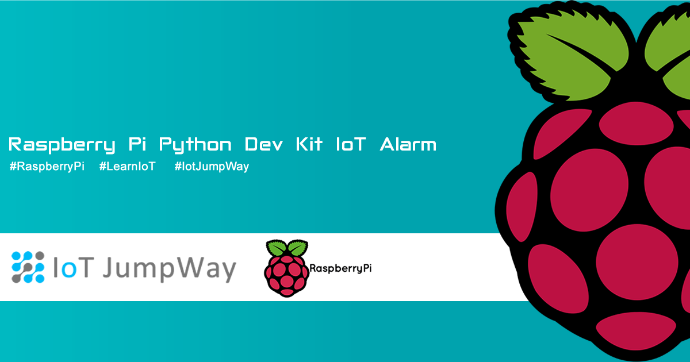
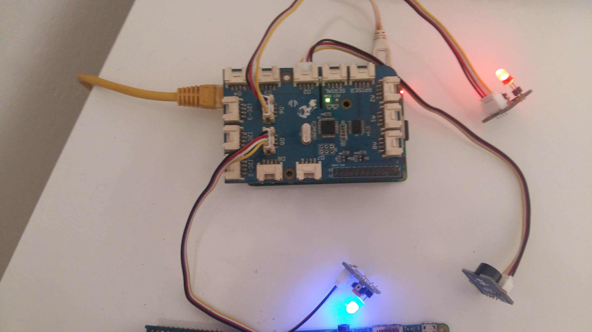
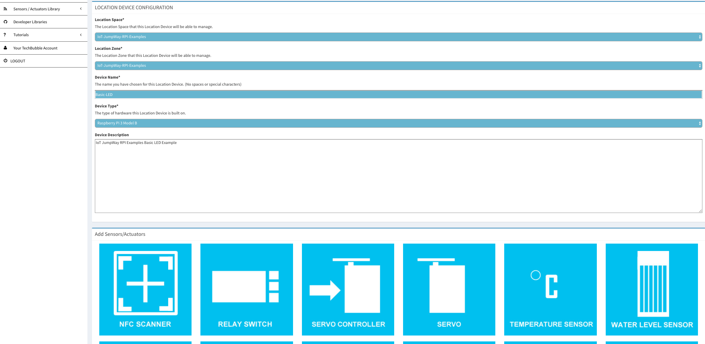

# IoT JumpWay Raspberry Pi Dev Kit IoT Alarm



## Introduction
Want to take your first steps into the magical world of the Internet of Things, or want to find out how easy it is to use the IoT JumpWay as your secure IoT communication platform? This tutorial is for you and will hold your hand through setting up your first Raspberry Pi Dev Kit IoT Alarm project powered by the IoT JumpWay.

## What Will We Build?

This tutorial is a simple tutorial that will help you take your first steps to using the IoT JumpWay to connect your IoT devices and applications to the Internet of Things.

The tutorial will use IoT JumpWay Python MQTT Library for communication, a Raspberry Pi with a Grove IoT Dev Kit, 2 x LEDs, 1 x buzzer, and an application that can control the LEDs and buzzer via the IoT JumpWay.

## Python Versions

- 3.4 or above

## Software Requirements

- [IoT JumpWay Python MQTT Client](https://github.com/iotJumpway/JumpWayMQTT "IoT JumpWay Python MQTT Client")

## Hardware requirements


- 1 x Raspberry Pi 3
- 1 x Grove starter kit for IoT, Raspberry Pi edition
- 1 x Blue LED (Grove)
- 1 x Red LED (Grove)
- 1 x Buzzer (Grove)

## Before You Begin

There are a few tutorials that you should follow before beginning, especially if it is the first time you have followed any of our Raspberry Pi tutorials or if it is the first time you have used the IoT JumpWay Developer Program. If this is the first time you have used the IoT JumpWay in your IoT projects, you will require a developer account and some basics to be set up before you can start creating your IoT devices. Visit the following [IoT JumpWay Developer Program Docs (5-10 minute read/setup)](https://github.com/iotJumpway/IoT-JumpWay-Docs/ "IoT JumpWay Developer Program Docs (5-10 minute read/setup)") and check out the guides that take you through registration and setting up your Location Space, Zones, Devices and Applications (About 5 minutes read).

- [IoT JumpWay Developer Program Docs (5-10 minute read/setup)](https://github.com/iotJumpway/IoT-JumpWay-Docs/ "IoT JumpWay Developer Program Docs (5-10 minute read/setup)")

- [Preparing Your Raspberry Pi](https://github.com/iotJumpway/IoT-JumpWay-RPI-Examples/blob/master/_DOCS/1-Raspberry-Pi-Prep.md "Preparing Your Raspberry Pi")

## Preparing Your Raspberry Pi 3

Take some time to ensure your Raspberry Pi firmware and packages are up to date, and that your device is secure by following the [Raspberry Pi 3 Preparation Doc](https://github.com/iotJumpway/IoT-JumpWay-RPI-Examples/blob/master/_DOCS/1-Raspberry-Pi-Prep.md "Raspberry Pi 3 Preparation Doc") tutorial.

## Cloning The Repo

You will need to clone this repository to a location on your Raspberry Pi 3. Navigate to the directory you would like to download it to and issue the following commands.

    $ git clone https://github.com/iotJumpway/IoT-JumpWay-RPI-Examples.git

## Install Requirements

    $ cd IoT-JumpWay-RPI-Examples/Dev-Kit-IoT-Alarm/Python
	$ (sudo) pip install --upgrade pip
    $ (sudo) pip install -r requirements.txt

## Setting Up Your Raspberry Pi



First of all you need to connect up an LED to your Raspberry Pi. To connect the LED you will need a breadboard, a 220 ohm resistor, and two jumper wires.

1. Connect your Grove IoT Dev Kit to your Raspberry Pi.
2. Connect one of your LEDs to pin D5 on your Grove shield, this will be your **"OK"** status LED.
3. Connect one of your LEDs to pin D6 on your Grove shield, this will be your **"WARNING"** status LED.
4. Connect your buzzer to D2 on Grove shield.

## Device / Application Connection Credentials & Sensor Settings

- Follow the [IoT JumpWay Developer Program (BETA) Location Device Doc](https://github.com/iotJumpway/IoT-JumpWay-Docs/blob/master/4-Location-Devices.md "IoT JumpWay Developer Program (BETA) Location Device Doc") to set up your device, and the [IoT JumpWay Developer Program (BETA) Location Application Doc](https://github.com/iotJumpway/IoT-JumpWay-Docs/blob/master/5-Location-Applications.md "IoT JumpWay Developer Program (BETA) Location Application Doc") to set up your application.



- Retrieve your connection credentials and update the config.json file with your new connection credentials and actuator (falseLED, trueLED & Buzzer) settings.

```
"IoTJumpWay": {
    "Location": 0,
    "Zone": 0,
    "Device": 0,
    "DeviceName" : "",
    "App": 0,
    "AppName": ""
}
```

```
"Actuators": {
    "falseLED": {
        "ID": 0,
        "PIN": 5
    },
    "trueLED": {
        "ID": 0,
        "PIN": 6
    },
    "Buzzer": {
        "ID": 0,
        "PIN": 2
    }
}
```

```
"IoTJumpWayMQTT": {
    "MQTTUsername": "",
    "MQTTPassword": "",
    "AppMQTTUsername": "",
    "AppMQTTPassword": ""
}
```

## Execute The Programs

    $ sudo python/python3 Device.py
    $ sudo python/python3 Application.py

## Viewing Your Data

Each command sent to the device is stored in the [IoT JumpWay](https://iot.techbubbletechnologies.com/ "IoT JumpWay"). You will be able to access the data in the [IoT JumpWay Developers Area](https://iot.techbubbletechnologies.com/developers/dashboard/ "IoT JumpWay Developers Area"). Once you have logged into the Developers Area, visit the [IoT JumpWay Location Devices Page](https://iot.techbubbletechnologies.com/developers/location-devices "Location Devices page"), find your device and then visit the Commands Data page to view the data sent from your device.


## Bugs/Issues

Please feel free to create issues for bugs and general issues you come across whilst using the IoT JumpWay Raspberry Pi Examples. You may also use the issues area to ask for general help whilst using the IoT JumpWay Raspberry Pi Examples in your IoT projects.

## Contributors

[](https://github.com/AdamMiltonBarker)