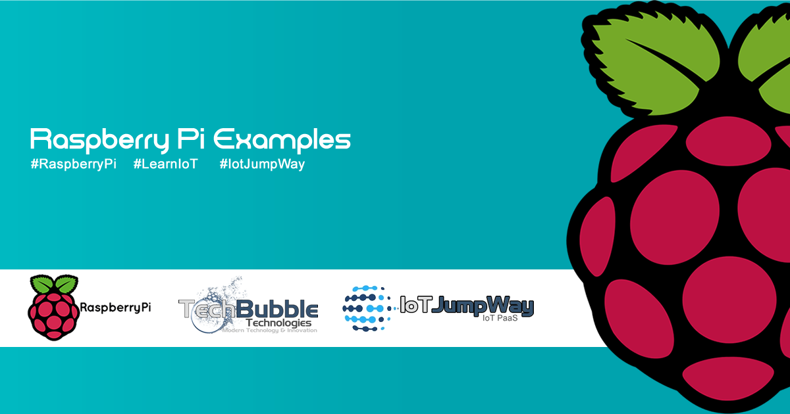

# IoT JumpWay Raspberry Pi Examples

## Introduction

IoT JumpWay is an IoT PaaS that allows anyone to connect IoT devices such as Raspberry Pi, Intel® Galileo, Arduino, ESP8266 and even phones,PCs, Macs and laptops to the Internet of Things. The various IoT JumpWay libraries and samples allow you to connect devices and sensors to the IoT JumpWay and control/monitor sensors/actuators and data to and from the devices.

The Raspberry Pi examples provide example projects that you can use to get started with using the IoT JumpWay for your IoT projects.

## Examples

- [Basic: Basic LED Python Example](https://github.com/iotJumpway/IoT-JumpWay-RPI-Examples/tree/master/Basic-LED/Python "Basic: Basic LED Python Example")

- [Computer Vision: Facial Recognition & Identification Python Example](https://github.com/iotJumpway/IoT-JumpWay-RPI-Examples/tree/master/Computer-Vision/Python "Computer Vision: Facial Recognition & Identification Python Example")

## Docs

- [Preparing Your Raspberry Pi](https://github.com/iotJumpway/IoT-JumpWay-RPI-Examples/blob/master/_DOCS/1-Raspberry-Pi-Prep.md "Preparing Your Raspberry Pi")

- [Setup Domain Name & SSL For Your Raspberry Pi](https://github.com/iotJumpway/IoT-JumpWay-RPI-Examples/blob/master/_DOCS/3-Raspberry-Pi-Domain-And-SSL.md "Setup Domain Name & SSL For Your Raspberry Pi")

- [Installing OpenCV 3.2.0 On Your Raspberry Pi (LATEST RELEASE)](https://github.com/iotJumpway/IoT-JumpWay-RPI-Examples/blob/master/_DOCS/2-Installing-OpenCV-3-2-0.md "Installing OpenCV 3.2.0 On Your Raspberry Pi (LATEST RELEASE)")

- [Installing OpenCV 3.1.0 On Your Raspberry Pi](https://github.com/iotJumpway/IoT-JumpWay-RPI-Examples/blob/master/_DOCS/2-Installing-OpenCV.md "Installing OpenCV 3.1.0 On Your Raspberry Pi")

- [Installing Linux Motion On Your Raspberry Pi](https://github.com/iotJumpway/IoT-JumpWay-RPI-Examples/blob/master/_DOCS/5-Installing-Motion.md "Installing Linux Motion On Your Raspberry Pi")

- [Installing Secure Nginx Server For Linux Motion On Raspberry Pi](https://github.com/iotJumpway/IoT-JumpWay-RPI-Examples/blob/master/_DOCS/6-Secure-Nginx-Server-For-Motion.md "Installing Secure Nginx Server For Linux Motion On Raspberry Pi")

- [Securing Your Raspberry Pi With IPTables](https://github.com/iotJumpway/IoT-JumpWay-RPI-Examples/blob/master/_DOCS/4-Securing-Your-Raspberry-Pi-With-IPTables.md "Securing Your Raspberry Pi With IPTables")

## Bugs/Issues

Please feel free to create issues for bugs and general issues you come across whilst using the IoT JumpWay Raspberry Pi Examples. You may also use the issues area to ask for general help whilst using the IoT JumpWay Raspberry Pi Examples in your IoT projects.

## Contributors

