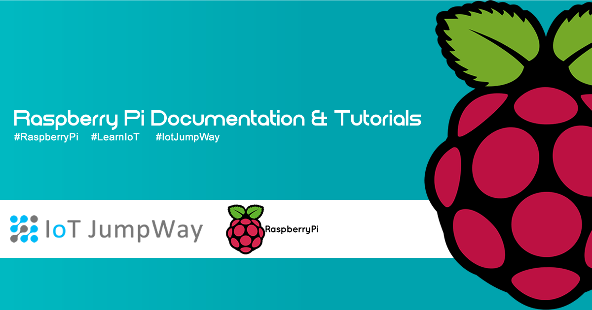

# Preparing your Raspberry Pi



## Introduction

The following information will help you setup and secure your Raspberry Pi.

## Hardware Requirements

1. Raspberry Pi.

## Software Requirements

1. Jessie

## Guide

1. Expand your root file system:

    ```
    $ sudo raspi-config --expand-rootfs
    $ sudo reboot
    ```

2. Firmware update:

    ```
    $ sudo rpi-update
    ```

3. Update certificates:

    ```
    $ sudo apt-get install ca-certificates
    ```

3. Software update / upgrade:

    ```
    $ sudo apt-get update
    $ sudo apt-get upgrade
    $ sudo apt-get dist-upgrade
    ```

4. Create new superuser:

    ```
    $ sudo useradd -m USERNAME -G sudo
    ```

5. Change user password for new superuser:

    $ sudo passwd USERNAME

6. Reboot and login with new superuser

    ```
    $ sudo reboot
    ```

8. Check sudo powers:

    ```
    $ sudo visudo
    ```

9. Remove default Pi user and directory:

    ```
    $ sudo deluser -remove-home pi
    ```

10. Reboot

    ```
    $ sudo reboot
    ```

## Bugs/Issues

Please feel free to create issues for bugs and general issues you come across whilst using the IoT JumpWay Raspberry Pi Examples. You may also use the issues area to ask for general help whilst using the IoT JumpWay Raspberry Pi Examples in your IoT projects.

## Contributors

[](https://github.com/AdamMiltonBarker)